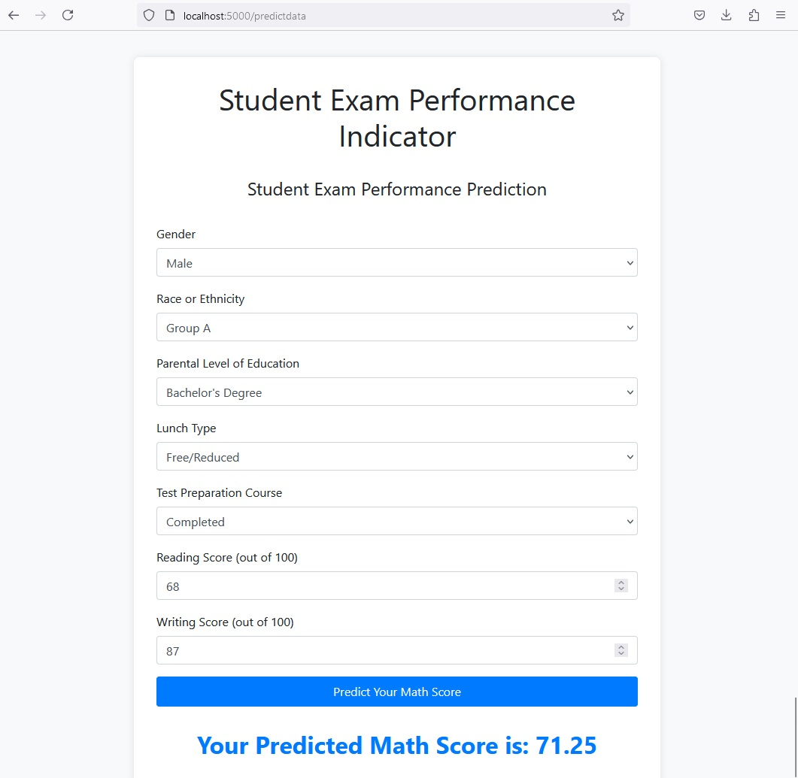

# Student Exam Performance Predictor (End-to-End MLOps Implementation)

This project demonstrates an **End-to-End MLOps implementation** for predicting a student's math score based on various factors such as gender, race/ethnicity, parental education level, lunch type, and performance in reading and writing exams. 

The project covers the entire machine learning lifecycle, from data ingestion and preprocessing to model training, evaluation, and deployment, seamlessly integrating both back-end and front-end components using Flask. The goal is to provide an interactive web-based application where users can input student details and receive real-time predictions for math scores.

### Key Concepts:
- **Machine Learning Pipeline**: The model is trained using multiple regression models (e.g., Random Forest, Decision Tree, XGBoost, and CatBoost), and the best-performing model is selected through a pipeline process based on the R-squared score.
- **Back-end (Flask)**: Flask serves as the back-end framework, handling:
  - **Model Training**: A training pipeline that ingests raw student data, preprocesses it, trains multiple regression models, and selects the best-performing model.
  - **Prediction Pipeline**: After the model is trained, Flask exposes an API endpoint that allows new predictions based on user inputs.
  - **Application Logic**: Flask orchestrates the entire workflow, from data ingestion, model training, and preprocessing to serving the trained model for predictions.

- **Front-end (Flask-based Web Interface)**: 
  - The front-end is designed using Flask’s templating engine, **Jinja2**, and styled with **Bootstrap**, providing an interactive and responsive interface where users can input student information.
  - The interface includes form fields to capture the student's gender, race/ethnicity, parental education level, lunch type, and test scores in reading and writing.
  - Upon submission, the inputs are sent to the back-end, where the model processes the data and returns the predicted math score, which is then displayed on the same page.

- **MLOps Automation**: 
  - The project includes an automation script (`run_app.py`) that installs the necessary dependencies, runs the model training pipeline, starts the Flask application, and automatically opens the web app in the user's browser for predictions.
  - The MLOps aspect focuses on streamlining the model development and deployment lifecycle, ensuring that the model can be retrained, updated, and deployed seamlessly with minimal intervention.

### Overall Workflow:
1. **Front-end (User Input)**: 
   Users input the relevant student details via the web form on the homepage. The web interface is built with Flask’s HTML templating engine and Bootstrap for styling.

2. **Back-end (Model Prediction)**: 
   When the form is submitted, Flask routes the data to the back-end, where the model processes it using a pre-built pipeline to generate a math score prediction.

3. **Result Display**: 
   The predicted math score is displayed on the results page, providing real-time feedback to the user based on their input.

This architecture ensures a seamless interaction between users and the underlying machine learning model, making the process intuitive and interactive, while also demonstrating a full-fledged **MLOps pipeline**.

## Key Features of the Project:
- **Data Ingestion**: Read raw data, split it into training and test datasets.
- **Data Transformation**: Handle missing values, scale numerical features, encode categorical features.
- **Model Training**: Train multiple models such as Random Forest, Decision Tree, XGBoost, and CatBoost. The model with the best performance is selected based on the R-squared score.
- **Prediction Pipeline**: Take user input through a web form, preprocess the input data, and predict the math score using the trained model.
- **Web Interface**: A Flask web application is used to provide the interface for predictions.
- **MLOps Automation**: The project includes automation for running the training pipeline, starting the web application, and opening the web app in a browser using a single script.

## Project Structure

```
.
├── artifacts/                    # Contains saved models and preprocessing objects
├── notebook/                     # Jupyter notebooks for data analysis and model training
│   └── data/                     # Raw data used for model training
│       ├── 1. EDA STUDENT PERFORMANCE.ipynb   # Notebook for exploratory data analysis
│       └── 2. MODEL TRAINING.ipynb            # Notebook for model training and evaluation
├── src/                          # Main source directory for all components
│   ├── components/               # Data transformation and model training components
│   │   ├── data_ingestion.py      # Handles data ingestion, splitting data into train and test sets
│   │   ├── data_transformation.py # Preprocesses data (imputation, encoding, scaling)
│   │   └── model_trainer.py       # Trains multiple models and selects the best one
│   ├── pipeline/                 # Pipelines for training and predicting
│   │   ├── predict_pipeline.py    # Predicts math score based on user input data
│   │   └── train_pipeline.py      # Executes the end-to-end training pipeline
│   ├── exception.py              # Custom exceptions for error handling
│   ├── logger.py                 # Logger setup to track events and errors
│   └── utils.py                  # Utility functions (saving/loading objects, evaluating models)
├── static/                       # Static files (images, CSS, JS, etc.)
│   └── images/                   # Folder for storing images used in the project
│       ├── index.jpg             # Screenshot of the homepage
│       └── result.jpg            # Screenshot of the result page
├── venv/                         # Virtual environment
├── app.py                        # Flask web app entry point
├── run_app.py                    # Script to run training pipeline and start the Flask app
├── README.md                     # Project description and instructions (this file)
├── requirements.txt              # Python dependencies
└── setup.py                      # Project setup for packaging
```

## Installation

1. **Clone the repository**:
    ```bash
    git clone https://github.com/moizeali/student-exam-performance-predictor.git
    ```

2. **Navigate to the project directory**:
    ```bash
    cd student-exam-performance-predictor
    ```

3. **Create and activate a virtual environment**:

   - For **Linux/macOS**:
     ```bash
     python3 -m venv env              # Create a virtual environment named 'env'
     source env/bin/activate          # Activate the virtual environment
     ```

   - For **Windows**:
     ```bash
     python -m venv env               # Create a virtual environment named 'env'
     .\env\Scriptsctivate           # Activate the virtual environment
     ```
4. **Project Dependencies**:

   The project also supports dependency management using `pyproject.toml`. If you prefer using this approach for managing dependencies and project configuration, you can refer to the `pyproject.toml` file for setting up the project environment, as follows:

   

   ```toml

   [build-system]

   requires = ["setuptools>=42", "wheel"]

   build-backend = "setuptools.build_meta"


   [project]
   name = "student-exam-performance-predictor"
   description = "A machine learning model to predict student exam performance based on various features."
   readme = "README.md"
   requires-python = ">=3.8"


## Running the Application

To simplify the process, use the provided `run_app.py` script, which automates the following:
- Install the dependencies.
- Runs the model training pipeline.
- Starts the Flask web application.
- Opens the web browser at `http://localhost:5000`.

Run the following command to execute this script:
```bash
python run_app.py
```

This will:
- Train the model using `src/pipeline/train_pipeline.py`.
- Start the Flask app (`app.py`).
- Open `http://localhost:5000` in your browser automatically.

## Usage

### Web Interface
1. Go to the homepage (`http://localhost:5000/`), and click **Start Prediction**.
2. Fill out the form with student details, including gender, ethnicity, parental education, and scores for writing and reading.
3. Submit the form to get the predicted math score.

### Screenshots
- **Homepage Screenshot**: 

- **Prediction Result Screenshot**: 

### Prediction Pipeline
For making predictions programmatically, use the `predict_pipeline.py` file. For example:
```python
from src.pipeline.predict_pipeline import CustomData, PredictPipeline

data = CustomData(
    gender='male',
    race_ethnicity='group A',
    parental_level_of_education="bachelor's degree",
    lunch='standard',
    test_preparation_course='completed',
    reading_score=80,
    writing_score=78
)

predict_pipeline = PredictPipeline()
pred_df = data.get_data_as_data_frame()
prediction = predict_pipeline.predict(pred_df)
print(f"Predicted Math Score: {prediction[0]}")
```

## Files Overview

### `app.py`
The main Flask application that serves the HTML pages and handles requests for predicting student math scores.

### `run_app.py`
This script automates the process of:
1. Running the model training using the `train_pipeline.py`.
2. Starting the Flask application (`app.py`).
3. Opening the app in your browser (`http://localhost:5000`).

### `predict_pipeline.py`
- **PredictPipeline**: Loads the trained model and preprocessing pipeline to make predictions on new data.
- **CustomData**: Collects the input features, converts them into a pandas DataFrame, and prepares the data for the model.

### `train_pipeline.py`
The pipeline for training models, which includes:
- Data ingestion
- Data transformation
- Model training and selection
- Saving the best model and preprocessing object

### `data_transformation.py`
This file defines the preprocessing pipeline that handles:
- Imputation for missing values
- One-hot encoding for categorical features
- Scaling for numerical features

### `model_trainer.py`
Handles the training of different regression models and hyperparameter tuning using `GridSearchCV`. It selects the best model based on the R-squared score.

### `utils.py`
Utility functions for saving/loading models and evaluating the model's performance.

### `data_ingestion.py`
Handles reading data from a CSV file, splitting it into training and test sets, and saving the datasets.

## Deployment
To deploy the app to a platform like Heroku, you need to add the following files:
- `Procfile` (for defining how to run the app)
- `runtime.txt` (to specify the Python version)

## Future Improvements
- Support for more student attributes (e.g., previous academic scores).
- Addition of more regression models to improve accuracy.
- Enhanced feature engineering for better predictions.

## License
This project is licensed under the MIT License. See the [LICENSE](LICENSE) file for more details.
